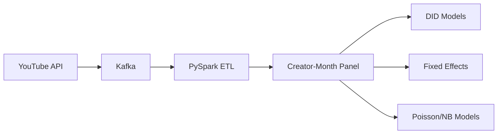

# Breaking the 15 Minute Barrier: How Policy Changes Shape Creator Activity on YouTube

## 📖 Project Summary

This project investigates how YouTube’s removal of the 15-minute upload limit affected creator behavior.

Using large-scale behavioral data collected through the YouTube Data API, Kafka, and PySpark, I constructed a creator-month panel dataset and applied causal inference methods to estimate the impact of platform policy changes on content production and engagement outcomes.

---

## 📊 Project Snapshot

| Item | Value |
|--------|--------|
| Videos Collected | 1.27M+ |
| Creators | 494 |
| Final Videos | 82,664 |
| Panel Observations | 11,856 |
| Time Period | Jan 2010 – Dec 2011 |
| Data Sources | YouTube Data API |

---

## 🔄 Data Pipeline

---

## 🧠 Methodology

### Causal Inference

- Difference-in-Differences (DID)
- Event Study

### Panel Data Analysis

- Fixed Effects Models

### Count Data Models

- Poisson Regression
- Negative Binomial Regression

---

## 📈 Key Findings

- General creators reduced posting frequency after the policy change.
- Professional creators increased posting frequency.
- Platform policy changes generated heterogeneous impacts across creator groups.

---

## ⚙️ Tools & Technologies

